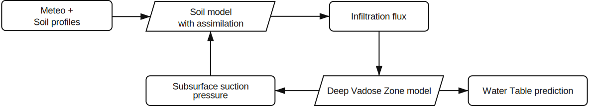

# Zarr-fuse datasets

## Zarr-fuse overview
The [zarr-fuse](https://github.com/GeoMop/zarr_fuse) subproject was substantially extended within HLAVO,
and HLAVO was the main motivation for its start. It provides a Python package and web services for
schema-based organization of large geospatial datasets in the [Zarr](https://zarr.dev/) format. Dataset
structure is defined by YAML schemas that document variables, units, and provenance. Zarr is chosen for
parallel reads/writes, chunked storage, and flexible analysis through [xarray](https://xarray.dev/) and
[Dask](https://www.dask.org/).

zarr-fuse adds dataset schema validation, ingestion pipelines, and consistent metadata conventions on
top of Zarr/xarray so that heterogeneous sources can be fused into aligned time/space grids.

## Meteo datasets
Schema: `hlavo/ingress/scrapper/schemas/hlavo_surface_schema.yaml`.
Several meteorological datasets are available through zarr-fuse automatic data ingerssion pipelines.
These are used by the surface models to predict water infiltration. These are fussed into a common
dataset `meteo` before simulation of a particular period and then directly used for the evapo-transpiration model.

### `yr.no` dataset
We download reguraly meteorological forecasts from [yr.no](https://www.yr.no/en) for 
points of the installed profile measurements. The data is stored in zarr-fuse dataset `yr_no`.

### CHMI - Aladin dataset
Forecast data from CHMI/ALADIN is ingested and aligned to the same grid and time axis as other meteo sources.

## Surface profile measurements

## Profile measurements
Schema: `hlavo/ingress/moist_profile/profile_schema.yaml`.
Soil moisture profiles are stored in a dedicated zarr-fuse dataset and are used to constrain the surface model.

## Simulations
In preparation.
